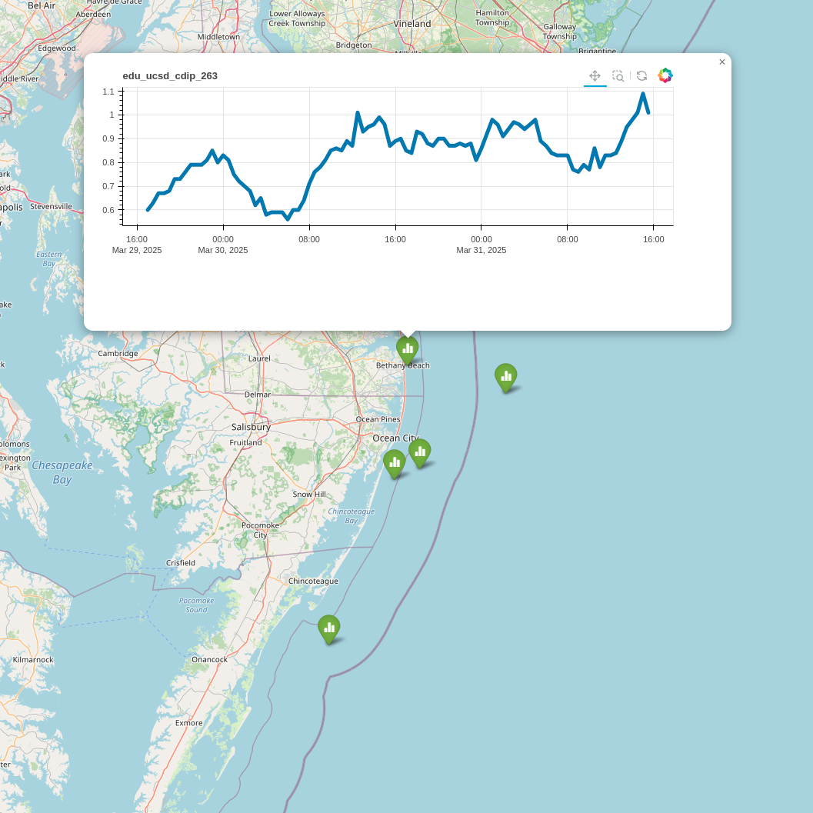

(nb-gallery)=
# Gallery

:::::{container}
::::{grid} 1 3 3 3
:gutter: 2

:::{grid-item-card} Fetching data from CO-OPS ERDDAP with Python tools
:margin: 3 0 0 0
:link: ./data_access_notebooks/2016-10-12-fetching_data.html
:link-type: url
:text-align: center
:shadow: md

{bdg-primary}`Data Access`
{bdg-secondary}`ERDDAP`
{bdg-info}`Python`
^^^

:::

:::{grid-item-card} Plotting Glider data with Python tools
:margin: 3 0 0 0
:link: ./data_access_notebooks/2016-11-15-glider_data_example.html
:link-type: url
:text-align: center
:shadow: md

{bdg-primary}`Data Access`
{bdg-secondary}`THREDDS`
{bdg-info}`Python`
^^^

:::

:::{grid-item-card} Accessing glider data via the Glider DAC API with Python
:margin: 3 0 0 0
:link: ./data_access_notebooks/2016-12-20-searching_glider_deployments.html
:link-type: url
:text-align: center
:shadow: md

{bdg-primary}`Data Access`
{bdg-secondary}`GDAC API`
{bdg-info}`Python`
^^^

:::

:::{grid-item-card} Read realtime data from IOOS Sensor Map via ERDDAP tabledap
:margin: 3 0 0 0
:link: ./data_access_notebooks/2017-03-21-ERDDAP_IOOS_Sensor_Map.html
:link-type: url
:text-align: center
:shadow: md

{bdg-primary}`Data Access`
{bdg-secondary}`Sensor Map`
{bdg-info}`Python`
^^^

:::

:::{grid-item-card} Using NCEI geoportal REST API to collect information about IOOS Regional Association archived data
:margin: 3 0 0 0
:link: ./data_access_notebooks/2017-06-12-NCEI_RA_archive_history.html
:link-type: url
:text-align: center
:shadow: md

{bdg-primary}`Data Access`
{bdg-secondary}`NCEI REST API`
{bdg-info}`Python`
^^^

:::

:::{grid-item-card} Using the `xtractomatic` R package to track Pacific Blue Marlin
:margin: 3 0 0 0
:link: ./data_access_notebooks/2017-08-01-xtractoR.html
:link-type: url
:text-align: center
:shadow: md

{bdg-primary}`Data Access`
{bdg-secondary}`ERDDAP`
{bdg-info}`R`
^^^

:::

:::{grid-item-card} Exploring the NHC Advisories and Sea Surface Height during Hurricane Irma
:margin: 3 0 0 0
:link: ./data_access_notebooks/2017-09-09-hurricane_irma.html
:link-type: url
:text-align: center
:shadow: md

{bdg-primary}`Data Access`
{bdg-secondary}`NHC/OPeNDAP`
{bdg-info}`Python`
^^^

:::

:::{grid-item-card} Calling R libraries from Python
:margin: 3 0 0 0
:link: ./data_access_notebooks/2017-11-30-rerddap.html
:link-type: url
:text-align: center
:shadow: md

{bdg-primary}`Data Access`
{bdg-secondary}`ERDDAP`
{bdg-info}`Python`
^^^

:::

:::{grid-item-card} Using r-obistools and r-obis to explore the OBIS database
:margin: 3 0 0 0
:link: ./data_access_notebooks/2018-02-20-obis.html
:link-type: url
:text-align: center
:shadow: md

{bdg-primary}`Data Access`
{bdg-secondary}`OBIS`
{bdg-info}`Pyhton/R`
^^^

:::

:::{grid-item-card} erddapy: a python client/URL builder for ERDDAP
:margin: 3 0 0 0
:link: ./data_access_notebooks/2018-03-01-erddapy.html
:link-type: url
:text-align: center
:shadow: md

{bdg-primary}`Data Access`
{bdg-secondary}`ERDDAP`
{bdg-info}`Python`
^^^

:::

:::{grid-item-card} IOOS models: Temperature Horizontal Slices
:margin: 3 0 0 0
:link: ./data_access_notebooks/2019-03-08-grids-temperature.html
:link-type: url
:text-align: center
:shadow: md

{bdg-primary}`Data Access`
{bdg-secondary}`THREDDS`
{bdg-info}`Python`
^^^

:::

:::{grid-item-card} Accessing data from SOS using NHC GIS files
:margin: 3 0 0 0
:link: ./data_access_notebooks/2019-05-27-hurricane_gis_part02.html
:link-type: url
:text-align: center
:shadow: md

{bdg-primary}`Data Access`
{bdg-secondary}`SOS`
{bdg-info}`Python`
^^^

:::

:::{grid-item-card} IOOS GTS Statistics
:margin: 3 0 0 0
:link: ./data_access_notebooks/2020-10-10-GTS.html
:link-type: url
:text-align: center
:shadow: md

{bdg-primary}`Data Access`
{bdg-secondary}`NDBC`
{bdg-info}`Python`
^^^

:::

:::{grid-item-card} Searching multiple ERDDAP servers
:margin: 3 0 0 0
:link: ./data_access_notebooks/2021-10-19-multiple-erddap-search.html
:link-type: url
:text-align: center
:shadow: md

{bdg-primary}`Data Access`
{bdg-secondary}`ERDDAP`
{bdg-info}`Python`
^^^

:::

:::{grid-item-card} Using pyobis to query for known datasets
:margin: 3 0 0 0
:link: ./data_access_notebooks/2022-11-23_pyobis_example.html
:link-type: url
:text-align: center
:shadow: md

{bdg-primary}`Data Access`
{bdg-secondary}`OBIS`
{bdg-info}`Python`
^^^

:::

:::{grid-item-card} Planning a surf trip using IOOS EDS Model Viewer
:margin: 3 0 0 0
:link: ./data_access_notebooks/2022-11-25-plan_surf_trip_EDS.html
:link-type: url
:text-align: center
:shadow: md

{bdg-primary}`Data Access`
{bdg-secondary}`Model Viewer`
{bdg-info}`python`
^^^

:::

:::{grid-item-card} Programmatically query the IOOS Data Catalog for a specific observation type
:margin: 3 0 0 0
:link: ./data_access_notebooks/2024-09-17-CKAN_API_Query.html
:link-type: url
:text-align: center
:shadow: md

{bdg-primary}`CKAN`
{bdg-secondary}`Catalog`
{bdg-info}`python`
^^^

:::

:::{grid-item-card} Parsing Conventions and standards with Python
:margin: 3 0 0 0
:link: ./data_analysis_and_visualization_notebooks/2016-11-16-CF-UGRID-SGRID-conventions.html
:link-type: url
:text-align: center
:shadow: md

{bdg-primary}`Data Analysis And Visualization`
{bdg-secondary}`CF/UGRID/SGRID`
{bdg-info}`Python`
^^^

:::

:::{grid-item-card} Quick demonstration of R-notebooks using the r-oce library
:margin: 3 0 0 0
:link: ./data_analysis_and_visualization_notebooks/2017-01-23-R-notebook.html
:link-type: url
:text-align: center
:shadow: md

{bdg-primary}`Data Analysis And Visualization`
{bdg-secondary}`R-demo`
{bdg-info}`R`
^^^

:::

:::{grid-item-card} A Matlab notebook primer
:margin: 3 0 0 0
:link: ./data_analysis_and_visualization_notebooks/2017-03-30-octave_notebook_example.html
:link-type: url
:text-align: center
:shadow: md

{bdg-primary}`Data Analysis And Visualization`
{bdg-secondary}`Matlab-demo`
{bdg-info}`Octave/Matlab`
^^^

:::

:::{grid-item-card} IOOS models
:margin: 3 0 0 0
:link: ./data_analysis_and_visualization_notebooks/2018-12-04-grids.html
:link-type: url
:text-align: center
:shadow: md

{bdg-primary}`Data Analysis And Visualization`
{bdg-secondary}`Mapping`
{bdg-info}`Python`
^^^

:::

:::{grid-item-card} IOOS QARTOD software (ioos_qc)
:margin: 3 0 0 0
:link: ./data_analysis_and_visualization_notebooks/2020-02-14-QARTOD_ioos_qc_Water-Level-Example.html
:link-type: url
:text-align: center
:shadow: md

{bdg-primary}`Data Analysis And Visualization`
{bdg-secondary}`QARTOD`
{bdg-info}`Python`
^^^

:::

:::{grid-item-card} Interpolating data remotely with ERDDAP
:margin: 3 0 0 0
:link: ./data_analysis_and_visualization_notebooks/2021-10-25-ERDDAP-interpolate.html
:link-type: url
:text-align: center
:shadow: md

{bdg-primary}`Data Analysis And Visualization`
{bdg-secondary}`ERDDAP`
{bdg-info}`Python`
^^^

:::

:::{grid-item-card} Interpolate MURSST to great white shark telemetry track with R and ERDDAP
:margin: 3 0 0 0
:link: ./data_analysis_and_visualization_notebooks/2024-05-16-white_shark_water_temp.html
:link-type: url
:text-align: center
:shadow: md

{bdg-primary}`ERDDAP`
{bdg-secondary}`MURSST Track Interpolation`
{bdg-info}`R`
^^^

:::

:::{grid-item-card} Using AphiaIDs to download OBIS occurrences for Bio/Eco EOVs
:margin: 3 0 0 0
:link: ./data_analysis_and_visualization_notebooks/2024-09-13-OBIS_EOVs.html
:link-type: url
:text-align: center
:shadow: md

{bdg-primary}`OBIS`
{bdg-secondary}`EOVs`
{bdg-info}`R`
^^^

:::

:::{grid-item-card} Shore Station Compliance Checker Script
:margin: 3 0 0 0
:link: ./data_management_notebooks/2017-05-14-running_compliance_checker.html
:link-type: url
:text-align: center
:shadow: md

{bdg-primary}`Data Management`
{bdg-secondary}`Compliance-checker`
{bdg-info}`Python`
^^^

:::

:::{grid-item-card} Using BagIt to tag oceanographic data
:margin: 3 0 0 0
:link: ./data_management_notebooks/2017-11-01-Creating-Archives-Using-Bagit.html
:link-type: url
:text-align: center
:shadow: md

{bdg-primary}`Data Management`
{bdg-secondary}`BagIt`
{bdg-info}`Python`
^^^

:::

:::{grid-item-card} Creating a CF-1.6 timeSeries using pocean
:margin: 3 0 0 0
:link: ./data_management_notebooks/2018-02-27-pocean-timeSeries-demo.html
:link-type: url
:text-align: center
:shadow: md

{bdg-primary}`Data Management`
{bdg-secondary}`CF`
{bdg-info}`Python`
^^^

:::

:::{grid-item-card} Aligning Data to Darwin Core
:margin: 3 0 0 0
:link: ./data_management_notebooks/2020-12-08-DataToDwC.html
:link-type: url
:text-align: center
:shadow: md

{bdg-primary}`Data Management`
{bdg-secondary}`Darwin Core`
{bdg-info}`Python`
^^^

:::

:::{grid-item-card} Reading and writting zarr files with xarray
:margin: 3 0 0 0
:link: ./data_management_notebooks/2023-03-20-Reading_and_writing_zarr.html
:link-type: url
:text-align: center
:shadow: md

{bdg-primary}`Data Management`
{bdg-secondary}`Zarr`
{bdg-info}`Python`
^^^

:::

::::
:::::
