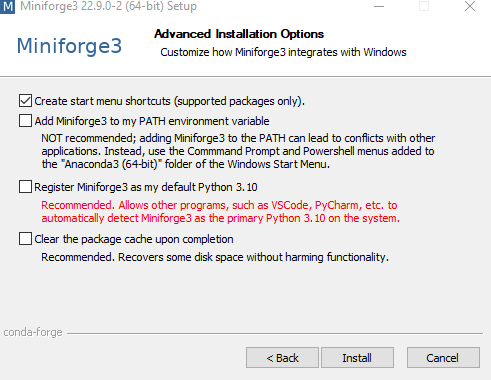
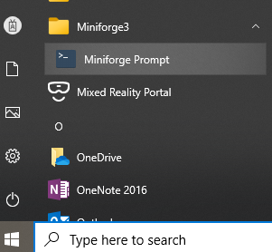

# Installing the IOOS conda environment

For IOOS Python/R/Julia users we recommend the free
[Miniforge](https://github.com/conda-forge/miniforge) distribution,
a lightweight version of the [Anaconda Scientific Python Distribution](https://www.anaconda.com/download) with the conda-forge channel pre-configured.
While the full Anaconda distribution will also work,
it is faster to install Miniforge and you can install only the packages you need.
If for some reason you decide later that you want the full Anaconda distribution,
you can install it by typing `conda install -c defaults anaconda`.

Note that if you have the Anaconda Distribution,
or any other installation,
in your machine you may want to follow
[these uninstall instructions](https://docs.anaconda.com/anaconda/install/uninstall/)
before proceeding.

## Install

Download and install the appropriate Miniforge3 installer for your platform.

### Windows

Download it from [https://github.com/conda-forge/miniforge](https://github.com/conda-forge/miniforge).
Run the installer
Choose _Just Me_ (not _All Users_),
and choose a install location owned by you.
The default is fine but kind of long.
We recommend something on your C drive like `C:\Miniforge`.

On the "Advanced Installation Options" screen,
uncheck the boxes to make Miniforge your default Python to avoid conflicts with any existing installation.



### Linux/macOS

Copy-and-paste this in the terminal:

```shell
curl -L -O "https://github.com/conda-forge/miniforge/releases/latest/download/Miniforge3-$(uname)-$(uname -m).sh"

bash Miniforge3-$(uname)-$(uname -m).sh
```

and use all the default options,
except for the license agreement where you must actively change it to `yes`.

## Create the IOOS conda environment

Download the [environment.yml](https://raw.githubusercontent.com/ioos/ioos_code_lab/main/.binder/environment.yml),
or the [environment-python_and_r.yml](https://raw.githubusercontent.com/ioos/ioos_code_lab/main/.binder/environment-python_and_r.yml) for a bigger environment with the R packages,
by right clicking with the mouse and choosing `save as...`,
or, on `macOS` and `Linux`, use these commands to download:

```bash
url=https://raw.githubusercontent.com/ioos/ioos_code_lab/main/.binder/environment.yml
curl $url -o environment.yml
```

Open the Miniforge Prompt by click on the icon below:



or open the Linux/macOS terminal.

Then, from the directory where you saved the file above,
type the following command to update the packages in your base environment,

```bash
conda update --yes --all
```

and

```bash
conda env create --quiet --file environment.yml
```

to create the IOOS environment locally.
Change the file name to environment-python_and_r.yml if you chose to use the IOOS environment with R.

That will update the packages in your base environment and then install the IOOS environment.
This will trigger the download and installation of many packages,
you should probably go get a coffee.

Once the environment is done building, you can activate it by typing:

```bash
conda activate IOOS
```

Now you can start hacking the notebook with `jupyter nbclassic`,
for the old style notebooks,
 or `jupyter-lab` for the new IDE interface.

## Exiting the IOOS environment

If you want to leave the IOOS environment and return to the root environment,
you can type

```bash
conda deactivate
```

## Updating the IOOS environment

To update an existing environment you can do,

```bash
conda activate IOOS
conda update --all --yes
```

Sometimes that operation can be slow if you have a really old version of the environment,
or even impossible to update due to package conflicts.
In that case we recommend removing and re-creating the environment.
To remove an existing environment you have to run:

```shell
conda env remove --name IOOS
```

and follow the instructions from above to re-create.
Note that you don't need to re-install Miniforge.
Just download a fresh version of the environment file and re-create it.

## Why we use and recommend conda

Conda users can just `conda install`,
which installs not only binary packages for their platform,
but the binary libraries they depend on.
So it's easier than `pip install` and, thanks to binary relocation,
more powerful than python wheels.
System-level installation of libraries and admin privileges are not required.
Check out [Travis Oliphant's blog piece](https://technicaldiscovery.blogspot.com/2013/12/why-i-promote-conda.html) for more info.

## How to get help

- Raise an issue [here](https://github.com/ioos/ioos_code_lab/issues)
- Please get help on the [IOOS-tech Google Group](https://groups.google.com/forum/?hl=en#!forum/ioos_tech)

## Appendix

### What to do when everything seems to be broken?

For example, if you are seeing kernel errors like the one below.


1. If you believe that only your environment is broken you can follow the [update environment](#updating-the-ioos-environment) instructions from above;
1. Sometimes conda updates can break backwards compatibility and updating is broken. In those cases remove the Miniforge3 directory and perform a fresh install of the new version.
1. In rare cases you may want to install a frozen version of the environment. Like, you need the exact same version that is running on our CIs. You can accomplish that by [downloading the lock file](https://raw.githubusercontent.com/ioos/ioos_code_lab/main/.binder/conda-lock.yml) and issuing the command:

```shell
conda create --name IOOS --file .binder/conda-lock.yml
```

### conda-lock

Locking environments can be useful for reproducibility,
Continuous Integration (CI),
or when one requires faster installation.
The reason is because a locked environment saves the "solved" list of packages and only downloads them.
Making it much faster than creating from the environment file,
and ensuring that the same packages from the time you locked will be used.

To lock an environment you will need to install conda-lock,

```shell
conda install conda-lock
```

then execute the locking command targeting the environment file you want to lock and the platforms, like:

```shell
conda-lock -f environment.yml -p osx-64 -p linux-64 -p win-64
```

In the example above we are locking for macOS, Linux and Windows.

### Trouble-shooting Windows

Windows can be complicated and here are a few tips to help you troubleshoot it:

1. If you did not install Miniforge on your C:\\ drive you may have a "long path error." Usually that happens when you see failures in the environment creation;
1. Installation is "successful" but nothing was installed. Please see https://github.com/ContinuumIO/anaconda-issues/issues/6258 for some reasons to why that us happening. Most common ones are aggressive anti-virus or bank apps blocking the installation;
1. Installation was successful but calling `jupyter nbclassic` just hangs while "waiting for localhost:" that is probably a firewall setting blocking the notebook or you need to update your packages. See [update environment](#updating-the-ioos-environment).
